# Drift Studio frontend views

Screenshots of the actual interactive browser demo. Service actions and fixture media are simulated. Viewport captures were checked at 1920×1080, 1440×900, 1024×768 and 390×844.

## Command Center
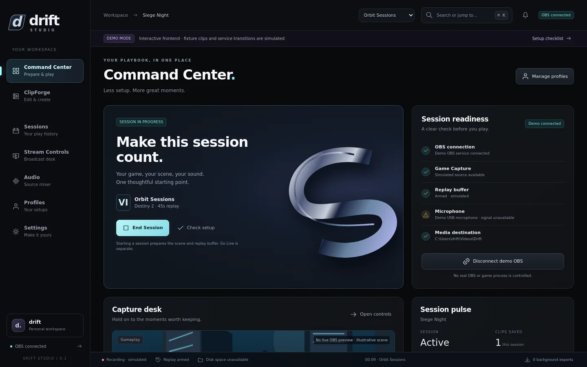

## ClipForge
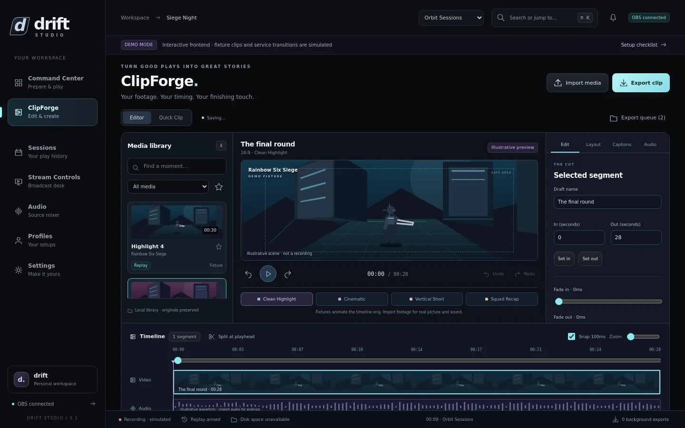

## Sessions
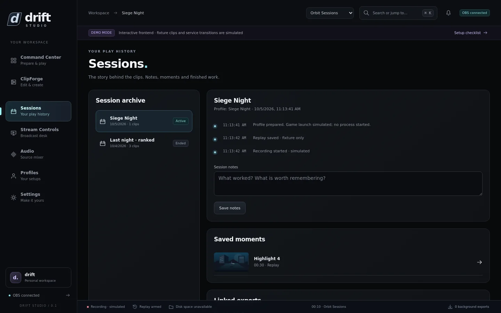

## Stream Controls
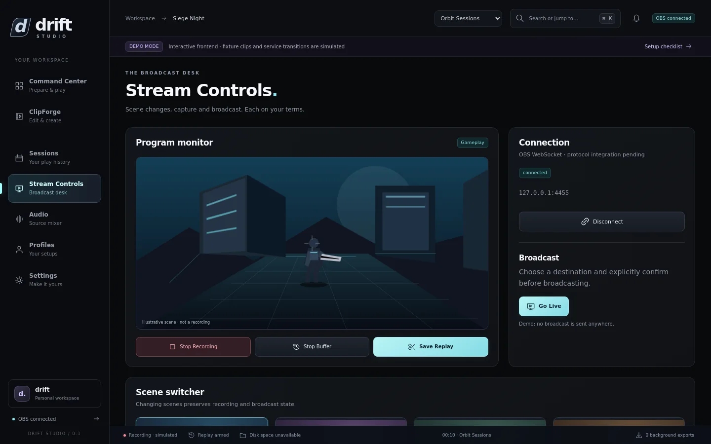

## Audio
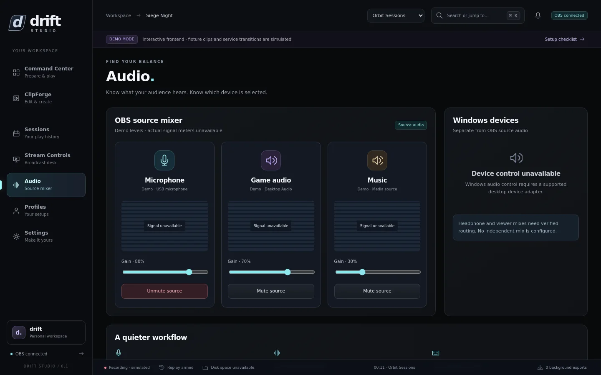

## Profiles
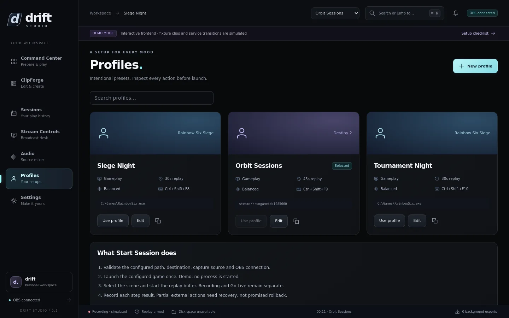

## Settings
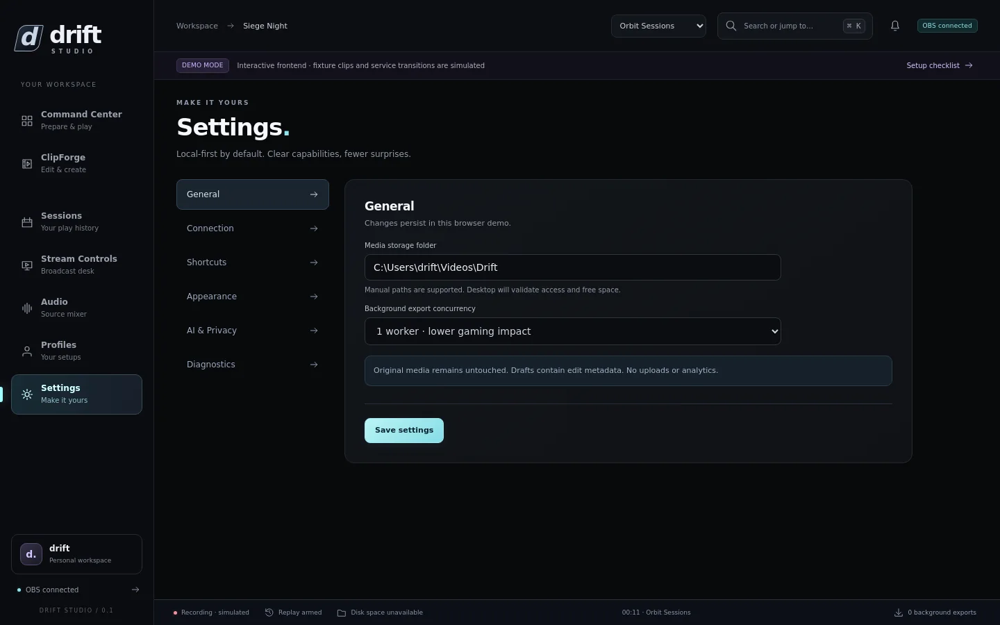

## Wider and smaller windows
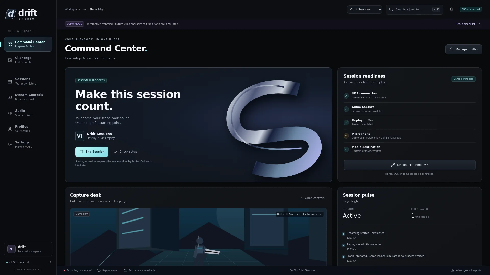
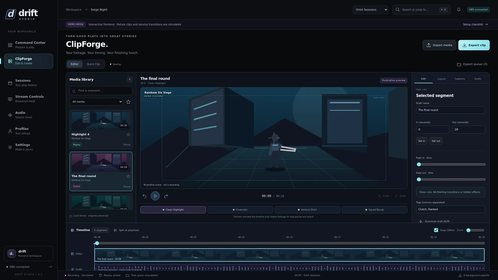
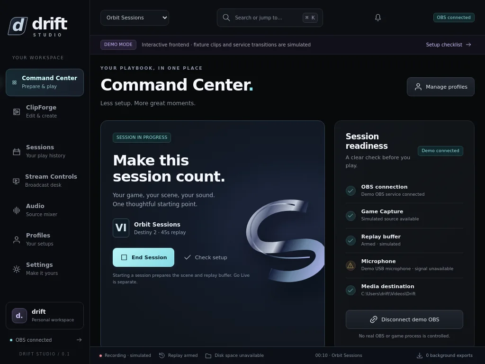
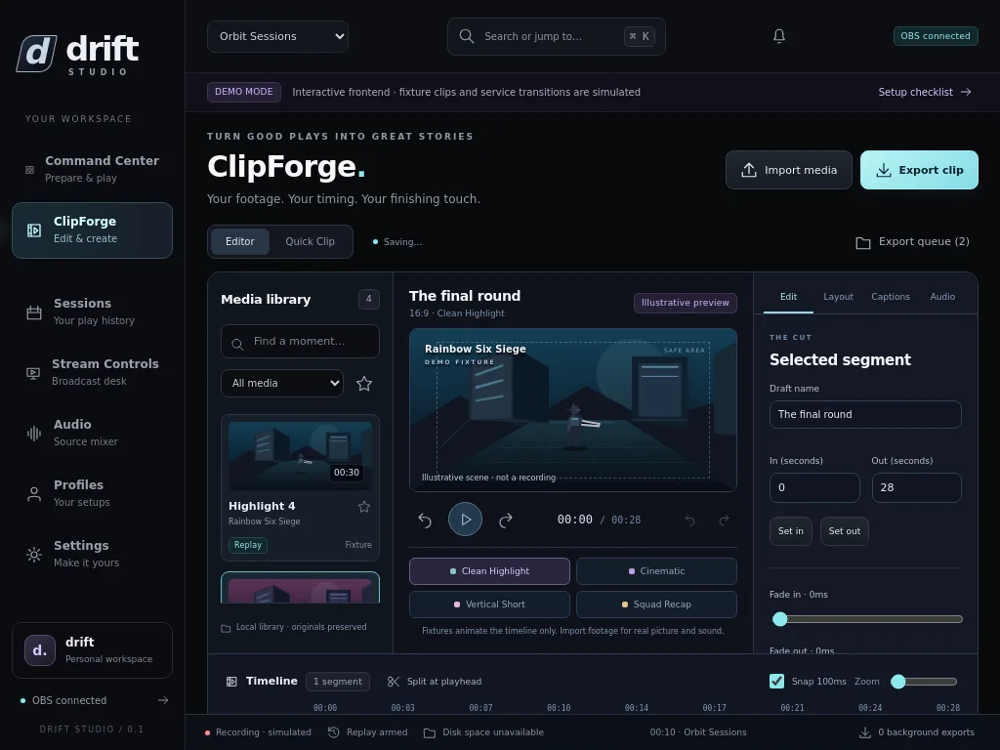
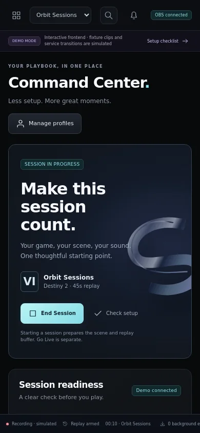
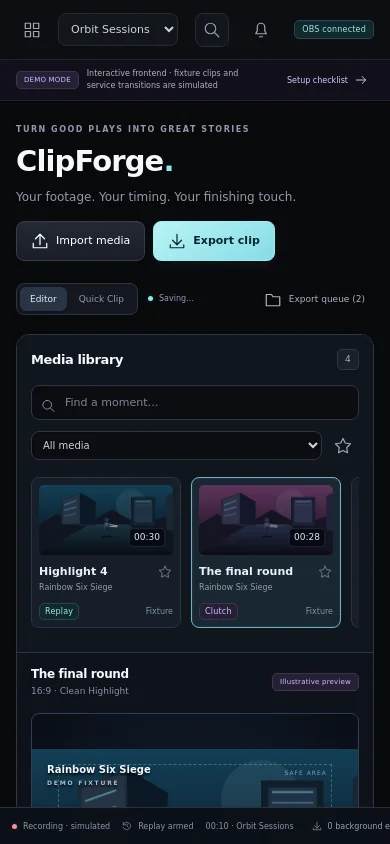

Smaller windows scroll vertically. The desktop application remains the target; mobile-width checks verify that resizing does not break the interface.
